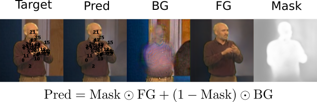

# Unsupervised Disentanglement of Pose, Appearance and Background from Images and Videos
Aysegul Dundar*, Kevin J. Shih*, Animesh Garg, Robert Pottorf, Andrew Tao, Bryan Catanzaro

This repository provides our implementation for learning unsupervised landmarks from video data, 
using a foreground-background factorized image reconstruction. Details provided in the following tech report: 
https://arxiv.org/abs/2001.09518
<div align="center">
  
</div>


## Setup
To download:
```
git clone https://github.com/NVIDIA/UnsupervisedLandmarkLearning.git --recursive
```

Tested with pytorch 1.1. May work with newer versions. The easiest way to get things running is to build the docker image located in: `docker/dockerfile`
```
cd docker/
docker build -t nvidia-unsupervised-landmarks -f dockerfile .
```
Then launch an interactive session with nvidia-docker with all the necessary paths to datasets and source code:
```
nvidia-docker run -v folder/to/mount:/path/in/container:rw -it nvidia-unsupervised-landmarks bash
```

## Datasets
### BBC
Download the train, val, and test images from `bbcpose_data_1.0.zip` from [here](https://www.robots.ox.ac.uk/~vgg/data/pose/index.html)
Unzipping should yield 20 tarballs, which should all be individually extracted into the same directory. You should end up with one directory with 20 subdirectories numbered 1 through 20.
Also download and extract `bbcpose_extbbcpose_code_1.0.tgz` into the same directory, which should create an additional `code` subdirectory. This will include the annotations necessary to evaluate on the test set.

## Landmark Training
This section covers how to train the model for learning the self-supervised landmark representation. This does not include the temporal dynamics model.

### Single GPU Training
The training command will look something like
```
python train.py --config configs/my_configs.yaml
```
where `my_configs.yaml` is replaced with the specific configuration file for the target dataset.

All training and model args are specified in the yaml file. Pleas refer to `configs/defaults.yaml` for descriptions of the configuration options. Most options should be left alone. The ones that you'll want to set are:
* `dataset_path`: path where the dataset is located
* `n_landmarks`: number of unsupervised landmarks to learn
* `use_fg_bg_mask`: enables unsupervised foreground-background mask prediction
* `use_identity_covariance`: when enabled, we assume the Gaussians for each landmark are isotropic with a fixed covariance. Otherwise, we fit the covariance to the underlying activation map. Identity covariance leads to higher landmark accuracy, but slightly lower image generation quality.
* `fixed_covar`: The diagonal value of the covariance matrix when `use_identity_covariance` is set
* `save_path`: path to where training output should be saved to. The tensorboard logfiles will be located there as well
* `use_gan`: Enables the adversarial loss. This enhances realism but slightly degrades the pixelwise precision of the landmarks.
* `use_temporal`: Enables temporal sampling (sampling for the same subject in a future frame) for obtaining pose variation during training
* `use_warped`: Enables thin-plate-spline warping. This tends to be unecessary when enough pose variation is provided by the temporal sampling. For static image datasets, this is the only option for sampling variations in pose during training.

The `configs` folder contains default configurations to use for each dataset, though at minimum, you will still need to set `dataset_path` and `save_path`. You can either
directly edit the configuration file, or specify it in command line with:
```
python train.py --config configs/my_configs.yaml --dataset_path path/to/dataset --save_path path/to/output/directory
```
In general, any option can be directly specified via commandline arguments. Commandline arguments take highest prededence, followed by the configuration file passed in via the `--config` argument. Any remaining unspecified arugments will use the default setting in `configs/defaults.yaml` (read automatically by `train.py` and does not need to be specified).

### Multi-GPU Training
To enable distributed data-parallel, simply enable the `use_DDP` by setting it to `true` in the configuration files or by appending `--use_DDP` to the command line arguments. The final commandline argument will look something like:

```
python -m torch.distributed.launch --nproc_per_node=$NGPUS python train.py --config configs/my_configs.yaml --dataset_path path/to/dataset --save_path path/to/output/directory --use_DDP
```
where `$NGPUS` is replaced with the number of GPUS you wish to use.

## BBC Landmark Evaluation
Here, we show how to evaluate a pre-trained landmark model on the BBC Pose dataset by regressing from the unsupervised landmarks to the annotated keypoints.

```
CKPT_DIR=/output/directory/for/pretrained/model
EP=5 % # epoch-indexed checkpoint file that we wish to load from. Using epoch 5, for example
TEST_ANNO_PATH=/path/to/bbcpose_data_1.0/code/results.mat
VAL_ANNO_PATH=/path/to/bbc_val_GT.mat # precomputed bbc validation set annotations, stored in the same format as the results.mat
# cache the gaussian landmarks for the training data
# landmarks will be stored in pkl files in the gauss_dumps directory
# opt.yaml is the configuration file holding all the options for the pretrained model. It will be automatically output during training
# WARNING: this might take 20-30 minutes, and requires a fair amount of RAM for the training set caching. 
python dump_preds.py --config $CKPT_DIR/opt.yaml --gaussians_save_path $CKPT_DIR/gauss_dumps --resume_ckpt $CKPT_DIR/checkpoint_${EP}.ckpt


# map the landmarks to the annotated keypoints with linear regression (no intercept)
python scripts/map_to_supervised_landmarks_bbc.py --gaussian_path $CKPT_DIR/gauss_dumps --out_path $CKPT_DIR/gauss_dumps

# load the test-set annotations and evaluate. This script should match the output provided by the matlab eval code in the BBC Pose code folder
python scripts/eval_supervised_landmarks_bbc.py --results_path $CKPT_DIR/gauss_dumps --test_anno_path $TEST_ANNO_PATH --val_anno_path $VAL_ANNO_PATH
```
## Pretrained Checkpoints
Coming soon!

## Acknowledgements
Our training pipeline closely follows the training pipeline as described in [Lorenz et al.](https://arxiv.org/pdf/1903.06946.pdf). Our generator code is heavily based off of [SPADE](https://github.com/NVlabs/SPADE) and [pix2pixHD](https://github.com/NVIDIA/pix2pixHD), which in turn borrow heavily from 
[pytorch-CycleGAN-and-pix2pix](https://github.com/junyanz/pytorch-CycleGAN-and-pix2pix). We also closely follow the evaluation script for BBC from [Unsupervised Learning of Object Landmarks through Conditional Image Generation](https://github.com/tomasjakab/imm).
